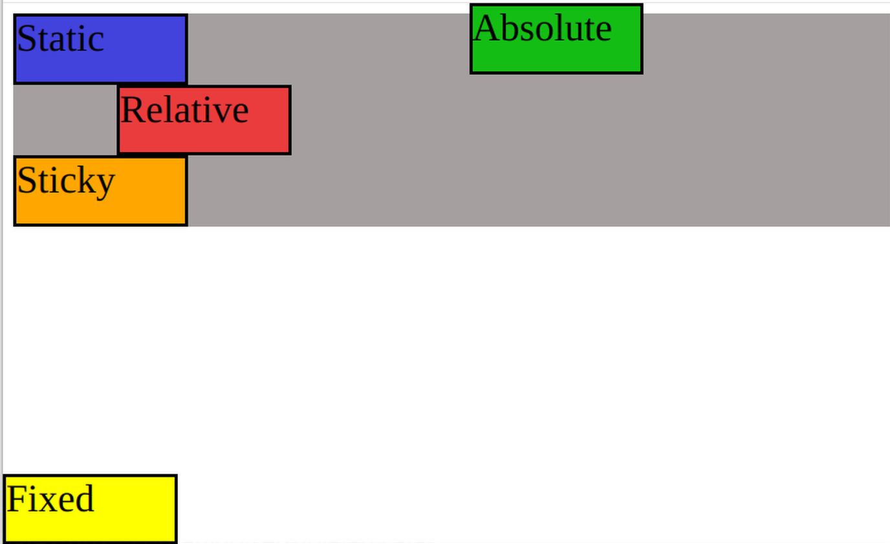
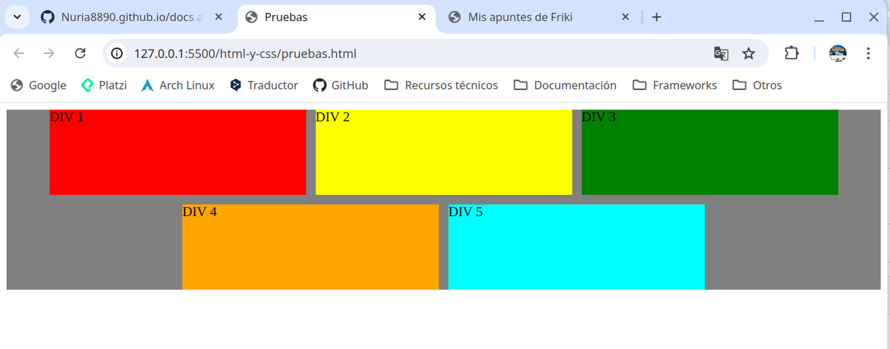
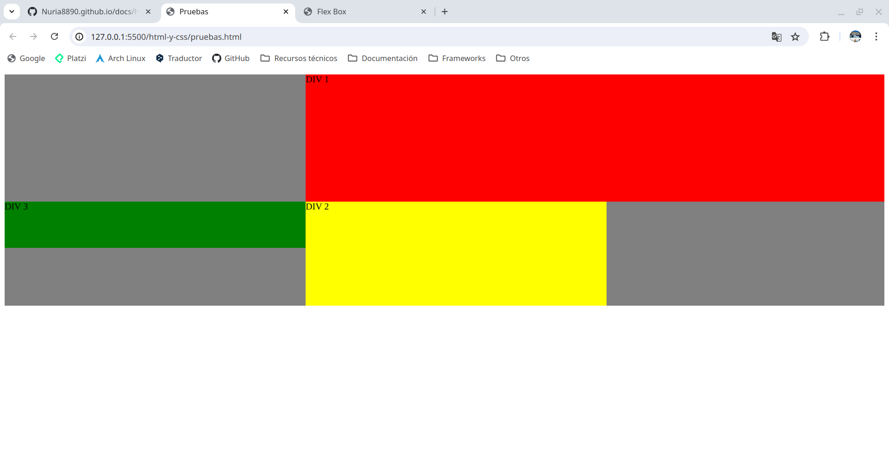
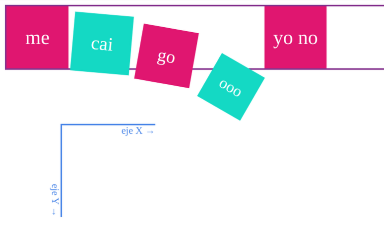

# Disposición y alineación de elementos

**Elemento**: etiqueta de apertura + contenido (inher) + etiqueta de cierre.

Las etiquetas con visualización **inline** (spam, button...) les dicen a sus hijas (o al texto que contengan): "yo no tengo tamaño, decidme qué tengo que pintar dentro y yo me adapto". Y a su contenedora: "ponme en línea con las demás". Por contra, las etiquetas con visualización **block** (p, h1...) les dicen a sus hijas: "mi tamaño es este, colocaos como podáis", aunque si no les imponemos tamaño se adaptan en altura. Y a su contenedora: "hazme hueco en la siguiente línea".

## Definir una tabla con css
*table*: define una tabla sin necesidad de usar < table >.

Dentro de la tabla, podemos imitar cada elemento:

*table-row*: se comporta como < tr >.

*table-cell*: se comporta como < td >.

*table-header-group*: se comporta como < thead > y nos permite convertir su contenido en cabeceras < th >.

*table-row-group*: se comporta como < tbody >.

*table-footer-group*: se comporta como < tfoot >, de nuevo convirtiendo las celdas en < th >.

*table-caption*: se comporta como < caption >.

[Ver ejemplo de una tabla en html](./html-y-css/html-etiquetas?id=lt-table-gt-lt-table-gt.md)

# Posicionamiento (position)
Vídeos para entender el posicionamiento:
- https://www.youtube.com/watch?v=13CbCpAnvYI
- https://www.youtube.com/watch?v=lSfKpltbvJs


```html
<!--HTML-->
<section>
    <div class="static">
      <span>Static</span>
    </div>

    <div class="relative">
      <span>Relative</span>
    </div>

    <div class="fixed">
      <span>Fixed</span>
    </div>

    <div class="absolute">
      <span>Absolute</span>
    </div>

    <div class="sticky">
      <span>Sticky</span>
    </div>
  </section>
```

```css
/*CSS*/
section {
  width: 100%;
  height: 100%;
  background-color: rgb(165, 159, 159);
}

div {
  width: 130px;
  height: 50px;
  font-size: 30px;
  border: 3px solid black;
}
```
- **Position: static;** es el que viene por defecto. No le afectan las coordenadas top, left, bottom y right aunque las especifiquemos.

```css
.static {
  background-color: rgb(66, 66, 221);
}
```

- **Position: relative;** nos permite posicionarle en relación a la posición que tendría si fuera static. // Movemos el div con respecto a los demás.

```css
.relative {
  background-color: rgb(234, 60, 60);
	position: relative;
	left: 80px; /*De la izquierda se separa 80px*/
	z-index: 10; /*Visualmente está en primer plano*/
}
```

- **Position: fixed;** independientemente del scroll que hagamos, siempre se va a mantener fijo. [queda fija en la página, y no se mueve aunque hagamos scroll; usa coordenadas absolutas en la página]

```css
.fixed{
  background-color: yellow;
	position: fixed;
	bottom: 0px; /*colocado abajo del todo de la página*/
	left: 0px; /*colocado a la izquierda del todo de la página*/
}
```

- **Position: absolute;** permite posicionarlo igual que el fixed pero en relación a su elemento padre. Normalmente se mete el div de clase absolute dentro del div de clase relative (elemento padre). Un recuadro (absolute) dentro de otro (relative). // El div se pone encima y "desaparece" el de al lado. [queda fija dentro de la página, y se mueve con la página; usa coordenadas absolutas en la página]

```css
.absolute{
  background-color: rgb(20, 189, 20);
	position: absolute;
	top: 0px; /*colocado arriba del todo de la página*/
	right: 200px; /*colocado a 200px de distancia de la derecha de la página*/
}
```

- **Position: sticky;** Es una mezcla entre el relative y el fixed. Se usa normalmente para los menús, al hacer scroll siempre está visible. [queda siempre visible dentro de su contenedor (no de la página), por tanto se comporta igual que absolute en este caso; pero requiere coordenadas relativas al contenedor y no a la página.]

```css
.sticky{
  background-color: rgb(255, 166, 0);
	position: sticky;
}
```




## [Flex Box](https://codepen.io/enxaneta/full/adLPwv)
Esta propiedad es un modo de diseño que permite colocar los elementos de una página para que se comporten de forma predecible cuando el diseño de la página debe acomodarse a diferentes tamaños de pantalla y diferentes dispositivos.

- **display: block;** los elementos ocupan el 100% del width de su contenedor y se colocan unos debajo de otros. Se puede agregar *margin en las cuatro posiciones*. (Los elementos que por defecto tienen display block son: "¿Tendría sentido meter este elemento dentro de un párrafo?". Si la respuesta es no, es muy probable que sea un elemento en block.) Ej: p, div, header, nav, list...

- **display: inline;** los elementos utilizan el width que ocupa su contenido, y si queda espacio, la siguiente etiqueta con display inline la pondrá después, en línea, no debajo. No se le puede agregar *margin ni arriba ni abajo*, *ni* se puede manipular *el width y el height* de los elementos. (Los elementos que por defecto tienen display inline son:  "¿Tendría sentido meter este elemento dentro de un párrafo?". Si la respuesta es sí, es muy probable que sea un elemento en línea.) Ej: span, a, input.

- **display: inline-block;** es una fusión del display inline y el display block. *De inline*: utiliza el width que ocupa su contenido. *De block*: se puede agregar margin en las cuatro posiciones. es decir, se comportan como elementos en línea, pero sí se puede ajustar su tamaño. Ej: img, button.

- **display: none;** oculta el elemento, no lo muestra.

- **display: flex;** afecta a la caja contenedora (donde se activa el modo flex) y a las cajas contenidas (las hijas directas). Se pueden usar varios recursos: 

  - **flex-direction: ___;** **row** (coloca los items en fila de izquierda a derecha, eje principal X), **row-reverse** (en fila en sentido inverso) , **column** (coloca los items en columna de arriba a abajo, eje principall Y), **column-reverse** (en columna en sentido inverso).

  - **flex-wrap: ___;** **wrap** (según se va haciendo pequeña la pantalla, los items cambian de posición y se van reordenando poniéndose unos debajo de los otros), **wrap-reverse** (se reordenan en sentido inverso, de abajo a arriba).

  - **flex-flow: column wrap;** combina flex direction y flex-wrap.

  - **justify-content: ___;** indica cómo quiero justificar el contenido con relación al eje principal. **center**(los coloca centrados), **flex-start** (junta todo el espacio libre a la derecha), **space-evenly** (mismo espacio entre todos los elementos y a los extremos), **space-between** (el primer elemento se alinea al inicio del contenedor, el último elemento se alinea al final, y los elementos intermedios se distribuyen uniformemente, dejando el mismo espacio entre ellos), **space-around** (hay un espacio igual al rededor de cada uno de los elementos), **flex-end** (junta todo el espacio libre a la izquierda).

  - **align-items: ___;** indica cómo colocar el contenido con relación al eje secundario. **center** (centrado), **strech** (los elementos se estiran al 100% de su contenedor padre), **flex-start** (junta todo el espacio libre abajo), **baseline** (los elementos se organizan en la línea de base), **flex-end** (junta todo el espacio libre arriba).

  - **align-self: ___;** permite a una caja hija cambiar la alineación especificada en la caja contenedora. Tiene los mismos valores que align-items.

  - **gap: *10px 20px*;** espacio entre cajas hijas.(*row-gap: 10px; ó column-gap: 10px;* permiten especificar de forma aislada la separación entre filas y entre columnas.)

  - **order: *5*;** por defecto las cajas hija se colocan en orden de llegada; si queremos adelantar o atrasar cajas lo podemos especificar.

  - **flex-grow: *2*;** cuando la pantalla crece, el div al que le haya puesto el flex-grow, se va haciendo más grande que el resto para, entre todos los div, ocupar el 100% del ancho de la pantalla. Un ejemplo: si tuviéramos las cajas 1 y 2 con flex-grow=1 y la 3 con flex-grow=2, y no tuvieran tamaño fijo, acabaríamos con una caja 3 de doble tamaño que las otras: [-1-] [-2-] [--3--]

  - **flex-shrink: *2*;** similar a flex-grow, pero en lugar de agrandar la caja hija, la reduce.

  - **flex-basis: *200px*;** define el tamaño por defecto de un elemento antes de distribuir el espacio. Puede usarse **auto** para que el tamaño del elemento se base en su contenido.

  - **flex: *3 1 auto*;** combina *flex-grow*, *flex-shrink* y *flex-basis*. Se recomienda usar esta propiedad, porque da valores con sentido a las que no.

  - **align-content: ___;** permite ajustar cómo quedan las filas o columnas en conjunto dentro de la caja contenedora, es decir, centra varias filas o columnas sin dejar hueco entre medias de cada fila o columna cuando hay espacio de sobra. **flex-start**, **center**, **stretch** (las líneas del contenedor se estiran para ocupar todo el espacio disponible en el eje transversal (eje contrario del principal)).

```html
<!-- HTML -->
<section>
    <div class="div-1">
      <span>DIV 1</span>
    </div>
    <div class="div-2">
      <span>DIV 2</span>
    </div>
    <div class="div-3">
      <span>DIV 3</span>
    </div>
    <div class="div-4">
      <span>DIV 4</span>
    </div>
    <div class="div-5">
      <span>DIV 5</span>
    </div>
  </section>
```

```css
/* CSS */

section {
  background-color: grey;
  display: flex;
  justify-content: center;
  gap: 0.7rem;
  align-items: center;
  flex-wrap: wrap;
}

div {
  width: 300px;
  height: 100px;
}
.div-1 {
  background-color: red;
}
.div-2 {
  background-color: yellow;
}
.div-3 {
  background-color: green;
}
.div-4 {
  background-color: orange;
}
.div-5 {
  background-color: aqua;
}
```



### Guía para un buen flexbox

- ¿Dónde debemos aplicar los estilos?
  - Los *estilos de la caja contenedora* (dirección, distribución...) los aplicamos en la propia caja contenedora.

  - Los *estilos comunes a todas las hijas* los aplicamos a una clase común para todas las hijas, por ejemplo: .item.

  - Si *una de las hijas* tiene una *disposición o tamaño diferente* a la de las demás, se le aplica estilos solo a esa caja con una clase propia, por ejemplo: .item-x.

- Procedimiento normal
  1. Aplicar *box-sizing* y *border* o *background-color* tanto a la caja contenedora como a las hijas para visualizar cómo se comportan (después se pueden borrar estos estilos).

  2. En la caja contenedora:
    - Indica: *display: flex*.

    - Elige *dirección del eje principal*: filas (row) o columnas (column). Hay que tener muy muy claro cuál queremos que sea el eje principal y cuál el secundario.

    - Indica la *dirección del eje principal*: flex-direction: row | column. No hay que confundir eje principal con eje horizontal, ni eje secundario con eje vertical.

    - Indica si quieres que los *items salten de fila* (o columna): flex-wrap: wrap, *o se mantengan en una sola*. A lo mejor es necesario añadir muchas hijas para poder ver el salto de línea.

    - Indica *cómo se alinean o distribuyen los elementos en el eje principal*, en el caso de que sobre o falte espacio: justify-content: center. (si no parece que no funciona es porque no sobra espacio y no se puede añadir espacio entre las hijas)

    - Indica *cómo se alinean o distribuyen los elementos en el eje secundario*: align-items: center. (si no parece que no funciona es porque no sobra espacio y no se puede añadir espacio entre las hijas)

  3. En los elementos items:
    - Indica a todos los items el *tamaño* que deben tener: ancho si el eje principal es horizontal o alto si el eje principal es vertical.

- Procedimiento avanzado
  1. Si queremos indicar un *ancho variable* en función del espacio sobrante o el espacio faltante, usamos: flex-grow, flex-shrink.

  2. Si queremos indicar un *ancho inicial* antes de repartir el espacio sobrante o faltante, usamos: flex-basis.

  3. Si queremos usar un *ancho fijo* usamos: width.

  4. Para indicar *en un elemento un tamaño especial* que debe tener: flex-grow, flex-shrink y flex-basis.

  5. Si queremos *cambiar el orden de las hijas* le aplicamos order a una de ellas, teniendo en cuenta que los órdenes menores de 0 se moverán a la izquierda y mayores de 0 se moverán a la derecha.

## Grid
**display: grid;**

**grid-template-columns:** Formas de colocar los items en tres columnas:\
    - **auto auto auto;\
    - repeat(3, auto);\
    - 20px 3rem 25vw;\
    - 1fr 1fr 3fr;**

**grid-template-rows: 220px 5rem 100px;** Le damos un tamaño a las filas

**grid-template-areas: 'head head head' 'main main aside' 'footer footer footer';**

**grid-column: 2 / span 2;** Quiero que este item empieze en el espacio 2 y ocupe 2 columnas

**grid-area: 2 / 2 / 4 / 3;** Quiero que este item ocupe desde la fila inicio 2 hasta la columna inicio 1, y desde la fila fin 4 hasta la columna fin 3.

```html
<!-- HTML -->
  <section>
    <div class="div-1">
      <span>DIV 1</span>
    </div>
    <div class="div-2">
      <span>DIV 2</span>
    </div>
    <div class="div-3">
      <span>DIV 3</span>
    </div>
```

```css
/* CSS */
section {
  background-color: grey;
  display: grid;
  grid-template-columns: auto auto auto;
  grid-template-rows: 220px 5rem 100px;
  grid-template-areas: 'head head head' 'main main aside' 'footer footer footer';
}

.div-1 {
  background-color: red;
  grid-column: 2 / span 2;
}
.div-2 {
  background-color: yellow;
  grid-area: 2 / 2 / 4 / 3;
}
.div-3 {
  background-color: green;
}
```



## Transform
### Transformaciones 2D
Los elementos cambian y se mueven por la página, pero no saca al elemento del flujo de la página como position absolute o fixed, ya que el resto de elementos de la página se comportan como si no hubiésemos aplicado una transformación a uno de ellos, respetando su "hueco" original.

  - **translate(*30px* *30px*)**: mueve el elemento en el plano las distancias especificadas. También tenemos las funciones individuales **translateX(dx)** y **translateY(dy)**.
  - **rotate(*15deg*)**: rota el elemento alrededor de un punto del plano. El punto se especifica con la propiedad **transform-origin**.
  -  **scale(*0.1*, *0.8*)**: nos permite modificar las dimensiones del elemento por los factores dados para X e Y. También tenemos las funciones individuales **scaleX(fx)**, **scaleY(fy)** y **scaleZ(fz)**.
  - **skew(ax, ay)**: estira el elemento en ambas direcciones, dándole el ángulo especificado. También tenemos las funciones individuales **skewX(a)** y *skewY(a)*. El efecto es parecido a un rombo.
  - **transform-origin**: la más útil, nos permite seleccionar el punto a partir del cual se aplican las transformaciones. Por ejemplo si queremos girar un elemento a partir de su centro (center, valor por defecto) o un punto determinado (ejemplo: transform-origin: 10px -20px).
  - **transform-box**: nos permite elegir si transformamos solo el contenido (content-box), el borde (border-box), el relleno (fill-box), el trazo (stroke-box) o la vista SVG (view-box). Para uso avanzado. 
  - **transform-style**: selecciona si las transformaciones son planas (flat, valor por defecto) o en 3D (preserve-3d),

  ```html
  <body>
    <div id="contenedor">
      <div class="cara" id="c1">me</div>
      <div class="cara" id="c2">cai</div>
      <div class="cara" id="c3">go</div>
      <div class="cara" id="c4">ooo</div>
      <div class="cara" id="c5">yo no</div>
      <div class="eje" id="x">eje X →</div>
      <div class="eje" id="y">eje Y →</div>
    </div>
  </body>
  ```

  ```css
  #contenedor {
  border: #84318d solid;
  color: white;
  }
  .cara {
  top: 100px;
  left: 100px;
  width: 100px;
  height: 100px;
  display: inline-flex;
  text-align: center;
  justify-content: center;
  align-items: center;
  font-size: 32px;
  }
  #c1 {
  background: #e01670;
  /* Prueba a descomentar las líneas siguientes */
  /* transform: translate(30px, 30px); */
  /* transform: rotate(15deg); */
  /* transform: scale(0.8); */
  }
  #c2 {
  background: #14d9c4;
  transform: translateY(10px) rotate(5deg) scale(0.95);
  }
  #c3 {
    background: #e01670;
    transform: translateY(30px) rotate(10deg) scale(0.9);
  }
  #c4 {
    background: #14d9c4;
    transform: translateY(80px) rotate(30deg) scale(0.8);
  }
  #c5 {
    background: #e01670;
  }
  .eje {
    border-top: #4a86e8 solid;
    position: absolute;
    top: 200px;
    left: 100px;
    width: 150px;
    text-align: right;
    color: #4a86e8;
    transform-origin: top left;
  }
  #x {
  }
  #y {
    transform: rotateZ(90deg);
  }
  ```

  

### Transformaciones 3D
Los elementos "se salen" de la página a lo largo de un eje Z invisible, hacen piruetas y luego terminan proyectados sobre la página otra vez.

  - **rotateX(ángulo)**, **rotateY(ángulo)**, **rotateZ(ángulo)**: rota el elemento alrededor del eje indicado.
  - **scale3d(fx, fy, fz)**: nos permite modificar las dimensiones del elemento por los factores dados. También tenemos las funciones individuales **scaleX(fx)**, **scaleY(fy)** y **scaleZ(fz)**.
  - **perspective(z)**: fija la distancia del punto de perspectiva (ejemplo: 800px). Como en fotografía, cuanto más cerca hagamos "la foto" más distorsionada saldrá la imagen.
  - **rotate3d(x, y, z, ángulo)**: genera una rotación alrededor del punto dado, del ángulo especificado.
  - **matrix3d(4x4)**: múltiples transformaciones en una, poco recomendable.
  - **transform-origin**: ya la vimos antes, pero ahora también podemos seleccionar un punto en el espacio 3D: transform-origin: 10px -20px -30px.
  - **perspective**: equivalente a la función perspective(), nos permite seleccionar la distancia del punto de perspectiva (ejemplo: 800px). Como en fotografía, cuanto más cerca hagamos "la foto" más distorsionada saldrá la imagen.
  - **perspective-origin**: nos permite seleccionar el punto desde el cual calculamos la perspectiva.