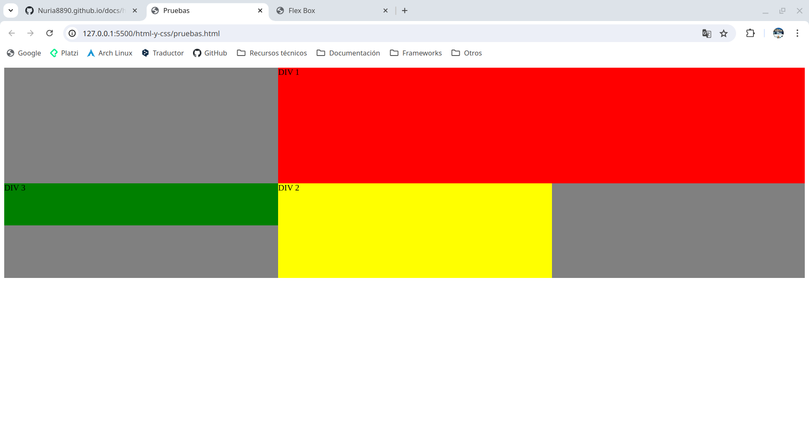
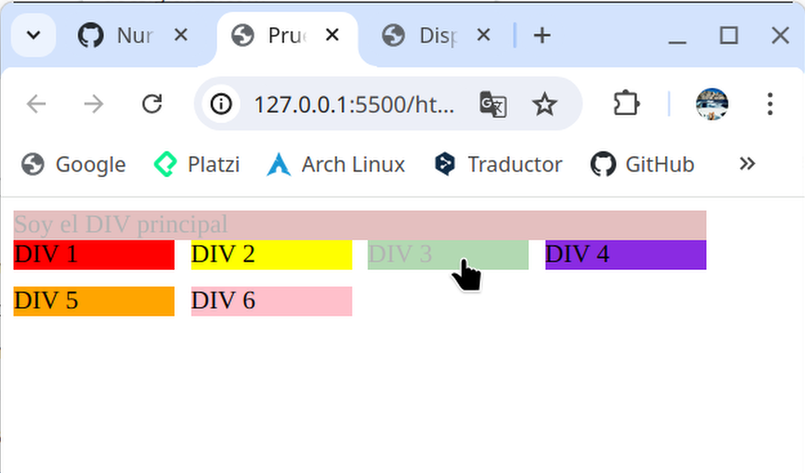

# CSS

```css
/* Restaurar valores */
* {
box-sizing: border-box;
padding: 0;
margin: 0;
}
html {
font-size: 62.5%; 
}
````

Se puede especificar el estilo de varias formas:

1. Directamente en la etiqueta del elemento *style*:

Style: atributo

Color: propiedad del atributo

Blue: valor de la propiedad

```html
<h1 style= “color: blue”>Mi primera página web</h1>
```

Todos los h1 tendrán ese formato:

```html
<head>
	<title> Mi primera página web</title>
		<style>
			h1{
				color: blue;
				font-size:15px;
			}
		</style>
```

2. Insertando en html un archivo css independiente.

```html
<head>
	<link href=”style.css” rel=”stylesheet”>
</head>
```

## Selectores
Definen sobre qué elementos se aplicará un conjunto de reglas CSS:

**Universal**: la regla que le impongamos se va a aplicar a TODO el documento.

```css
* {
	box-sizing: border-box; /* Hace que el width de la caja no sea solo el contenido, sino que suma también el padding y el border. El margin no lo suma*/
	padding: 0;
	margin: 0;
}
```

**De tipo**: permiten aplicar un formato a todos los elementos de un tipo específico

```css
html {
font-size: 62.5%; /* Al indicar este tamaño de fuente en html, 16px = 1.6rem. Así es más sencillo usar rem */
}

p,
ul,
ol {
	font-size: 2px;
}
```

**De clase**: permiten seleccionar todos los elementos que tienen una clase específica asignada.

```html
<ol class = "lista-de-gatos">
	<li>tratamientos antipulgas</li>
	<li>truenos</li>
</ol>
```

```css
.lista-de-gatos {
	color: red;
}
```


**De id**: permiten seleccionar el elemento con un id específico.

```html
<ol class = "lista-de-gatos">
	<li>tratamientos antipulgas</li>
	<li>truenos</li>
	<li id = tercer-li>agua</li>
	<li>perros</li>
</ol>
```

```css
/*Selector de clase:*/
.lista-de-gatos {
	color: red;
}

/*Selector de id:*/
#tercer-li {
	color: blue;
}
```


## Colores

1. **Predeterminados**

```css
h1{
	color: orange
}
```

2. **Hexadecimal**: en la web [Coolors](https://coolors.co/) hay ejemplos de paletas de colores.

```css
h1{
	color: #BCE784
}
```

3. **RGB**

```css
h1{
	color: rgb(100, 0, 200)
}
```

4. **RGBA**

```css
h1{
	color: rgba(100, 0, 200, 0.2)
}
```

## Margin y Padding
**Margin**: Espacio que guarda nuestro elementos con respecto al resto de elementos que hay en la página.

**Padding**: espacio que hay desde el borde del elemento al contenido.

```html
<div>
  <span>Esto es un div</span>
</div>
```

```css
div {
  width: 100px;
  margin: 10px 20px; /*Arriba y abajo, derecha e izquierda*/
  padding: 10px 20px 30px 40px; /*Arriba derecha abajo izquierda*/
}
```


## Medidas
- **Absolutas**: no cambia, sin importar el tamaño de la pantalla (px).
- **Relativas**: cambian en función del tamaño de la pantalla (%, em, rem, max-width, min-width, max-height, min-height, vw(viewport width), vh(viewport height))
  - **em (element)**: toma el tamaño de fuente que tiene su padre directo. 

```css
html {
  font-size: 62.5%; /* Al indicar este tamaño de fuente en html, 16px = 1.6em */
}

.section-em {
  font-size: 1.6em; 
}

.section-em div {
  font-size: 1.6em; /* 16px * 1.6em = 25.6px */
}

.section-em div p{
  font-size: 1.6em; /* 25.6px * 1.6em = 40.96px */
}
```
  - **rem (root element)**: toma el tamaño fuente que aparece en la etiqueta root.

```css
html {
  font-size: 62.5%; /* Al indicar este tamaño de fuente en html, 16px = 1.6rem */
}

.section-rem {
  font-size: 1.6rem;
}

.section-rem div {
  font-size: 1.6rem;
}

.section-rem div p{
  font-size: 1.6rem;
}
```


  - **width**: 80%; El div siempre va a ocupar el 80% de la pantalla.
  - **min-width**: 320px; El div nunca va a ser más pequeño que 320px. Cuando llegue a esta medida, no segurá adaptándose al tamaño de la pantalla y ocupará el 100% en vez del 80%.
  - **max-width**: 500px; el div nunca va a ser más grande que 500px. Mientras va llegando a ese tamaño, estará ocupando el 80% de la pantalla y, cuando llegue, el div no segurá adaptándose al tamaño de la pantalla, se quedará en 500px.
  - **min-height**: 500px; La altura mínima del div va a ser 500px, pero si el contenido excede de este tamaño, puede crecer con el contenido hasta que el contenido deje de crecer.


## Fuentes
Importar fuentes:
1. Entrar en [google fonts.](https://fonts.google.com/?preview.layout=grid)
2. Elegir la fuente que quieres.
3. Seleccionar todos los tipos que vamos a necesitar (no seleccionar TODO, porque ralentizará mucho la web).
4. Copiar y pegar al head de html con un link, o directamente importar en CSS, copiar y pegar.

## Disposición y alineación de elementos

```html
<!--HTML-->
<section>
    <div class="static">
      <span>Static</span>
    </div>

    <div class="relative">
      <span>Relative</span>
    </div>

    <div class="fixed">
      <span>Fixed</span>
    </div>

    <div class="absolute">
      <span>Absolute</span>
    </div>

    <div class="sticky">
      <span>Sticky</span>
    </div>
  </section>
```

```css
/*CSS*/
section {
  width: 100%;
  height: 100%;
  background-color: rgb(165, 159, 159);
}

div {
  width: 130px;
  height: 50px;
  font-size: 30px;
  border: 3px solid black;
}
```
- Static: es el que viene por defecto.

```css
.static {
  background-color: rgb(66, 66, 221);
}
```

- Relative: nos permite posicionarle en relación a la posición que tendría si fuera static. // Movemos el div con respecto a los demás.

```css
.relative {
  background-color: rgb(234, 60, 60);
	position: relative;
	left: 80px; /*De la izquierda se separa 80px*/
	z-index: 10; /*Visualmente está en primer plano*/
}
```

- Fixed: independientemente del scroll que hagamos, siempre se va a mantener fijo.

```css
.fixed{
  background-color: yellow;
	position: fixed;
	bottom: 0px; /*colocado abajo del todo de la página*/
	left: 0px; /*colocado a la izquierda del todo de la página*/
}
```

- Absolute: permite posicionarlo igual que el fixed pero en relación a su elemento padre. Normalmente se mete el div de clase absolute dentro del div de clase relative (elemento padre). Un recuadro (absolute) dentro de otro (relative). // El div se pone encima y "desaparece" el de al lado.

```css
.absolute{
  background-color: rgb(20, 189, 20);
	position: absolute;
	top: 0px; /*colocado arriba del todo de la página*/
	right: 200px; /*colocado a 200px de distancia de la derecha de la página*/
}
```

- Sticky: Es una mezcla entre el relative y el fixed. Se usa normalmente para los menús, al hacer scroll siempre está visible.

```css
.sticky{
  background-color: rgb(255, 166, 0);
	position: sticky;
}
```


### [Flex Box](https://codepen.io/enxaneta/full/adLPwv)

- **display: block;** utiliza el 100% del widrh de su contenedor. Se puede agregar margin en las cuatro posiciones.

- **display: inline;** utiliza el width que ocupa su contenido, y si queda espacio, la siguiente etiqueta con display inline la pondrá después, no debajo. No se le puede agregar margin ni arriba ni abajo, ni se puede manipular el widht y el height de los elementos.

- **display: inline-block** es una fusión del display inline y el display block. *De inline*: utiliza el width que ocupa su contenido. *De block*: se puede agregar margin en las cuatro posiciones.

- **display: flex;** hace qus sus hijos sean flexibles. Se pueden usar varios recursos: 

  - **justify-content: center;** indica cómo quiero justificar el contenido con relación al eje principal (X), es decir, en horizontal, en este caso los coloca centrados. *space-evenly* (mismo espacio entre todos los elementos y a los extremos).

  - **align-items: center;** indica cómo colocar el contenido con relación al eje secundario (Y), es decir, en vertical, en este caso centrado. *strech* (los elementos se estiran al 100% de su contenedor padre). *baseline* (los elementos se encogen al tamaño de su contenido).

  - **flex-direction: column;** coloca los items en fila de izquierda a derecha (row), o en columna (column) de arriba a abajo. cuando lo pongo en column, el eje principal y el eje secundario se intercambian (el X pasa a ser el secundario y el Y empieza a ser el principal).

  - **flex-wrap: wrap;** según se va haciendo pequeña la pantalla, los items cambian de posición y se van reordenando poniéndose unos debajo de los otros.

  - **flex-grow: 1;** cuando la pantalla crece, el div al que le haya puesto el flex.grow, se va haciendo más grande que el resto para, entre todos los div, ocupar el 100% del ancho de la pantalla.

```html
<!-- HTML -->
<section>
    <div class="div-1">
      <span>DIV 1</span>
    </div>
    <div class="div-2">
      <span>DIV 2</span>
    </div>
    <div class="div-3">
      <span>DIV 3</span>
    </div>
    <div class="div-4">
      <span>DIV 4</span>
    </div>
    <div class="div-5">
      <span>DIV 5</span>
    </div>
  </section>
```

```css
/* CSS */

/*¡¡¡REVISAR ESTE CÓDIGO PORQUE NO FUNCIONA BIEN!!!*/


section {
  width: 700px;
  height: 700px;
  background-color: grey;
  display: flex;
  justify-content: center;
  gap: 1rem;
  align-items: center;
  flex-direction: column;
  flex-wrap: wrap;
}

div {
  width: 100px;
  height: 100px;
}
.div-1 {
  background-color: red;
}
.div-2 {
  background-color: yellow;
}
.div-3 {
  background-color: green;
}
.div-4 {
  background-color: orange;
}
.div-5 {
  background-color: aqua;
}
```


### Grid
**display: grid;**

**grid-template-columns:** Formas de colocar los items en tres columnas:\
    - **auto auto auto;\
    - repeat(3, auto);\
    - 20px 3rem 25vw;\
    - 1fr 1fr 3fr;**

**grid-template-rows: 220px 5rem 100px;** Le damos un tamaño a las filas

**grid-template-areas: 'head head head' 'main main aside' 'footer footer footer';**

**grid-column: 2 / span 2;** Quiero que este item empieze en el espacio 2 y ocupe 2 columnas

**grid-area: 2 / 2 / 4 / 3;** Quiero que este item ocupe desde la fila inicio 2 hasta la columna inicio 1, y desde la fila fin 4 hasta la columna fin 3.

```html
<!-- HTML -->
  <section>
    <div class="div-1">
      <span>DIV 1</span>
    </div>
    <div class="div-2">
      <span>DIV 2</span>
    </div>
    <div class="div-3">
      <span>DIV 3</span>
    </div>
```

```css
/* CSS */
section {
  background-color: grey;
  display: grid;
  grid-template-columns: auto auto auto;
  grid-template-rows: 220px 5rem 100px;
  grid-template-areas: 'head head head' 'main main aside' 'footer footer footer';
}

.div-1 {
  background-color: red;
  grid-column: 2 / span 2;
}
.div-2 {
  background-color: yellow;
  grid-area: 2 / 2 / 4 / 3;
}
.div-3 {
  background-color: green;
}
```


## Variables

```css
:root {
  --color-principal: red;
  --ancho-principal: 250px;
}

.div-1 {
  background-color: var(--color-principal);
  width: var(--ancho-principal);
}
```

## Opacidad y galerías de imágenes

```html
<!-- HTML -->
<div class="div-ppal">
    <span>Soy el DIV principal</span>
  </div>
  <section class="galeria">
    <div class="div-1">
      <span>DIV 1</span>
    </div>
    <div class="div-2">
      <span>DIV 2</span>
    </div>
    <div class="div-3">
      <span>DIV 3</span>
    </div>
    <div class="div-4">
      <span>DIV 4</span>
    </div>
    <div class="div-5">
      <span>DIV 5</span>
    </div>
    <div class="div-6">
      <span>DIV 6</span>
    </div>
```

```css
/* CSS */
.div-ppal {
  background-color: brown;
  width: 430px;
  opacity: 0.3;
}

.div-ppal:hover {
  cursor: pointer;
  opacity: 1;
}

.galeria{
  display: flex;
  flex-wrap: wrap;
  gap: 10px;
}

.galeria div {
  width: 100px;
}

.galeria div:hover {
  opacity: 0.3;
  cursor: pointer;
}
.div-1 {
  background-color: red
}
.div-2 {
  background-color: yellow;
}
.div-3 {
  background-color: green;
}
.div-4 {
  background-color: blueviolet;
}
.div-5 {
  background-color: orange;
}
.div-6 {
  background-color: pink;
}
```



## [Pseudoclases](https://www.w3schools.com/css/css_pseudo_classes.asp)
Los más comunes son:
- **:hover**: se activa cuando paso el ratón por encima.
- **:focus**: se activa cuando hago click (por ejemplo enun formulario tipo texto, al pinchar cambia de color).
- **:first-child**: hace referencia al primer elemento (primer hijo) para darle una serie de características solo a ese elemento.
- **:link**: link no visitado todavía.
- **:visited**: link ya visitado.
- **:active**: estoy interaccionando (activando) ese elemento (estoy haciendo click en un link).

## [Pseudoelementos](https://www.w3schools.com/css/css_pseudo_elements.asp)
Estos son todos:
- **::before**: se usa para instertar contenido antes del contenido principal.
- **::after**: se usa para instertar contenido después del contenido principal.
- **::first-letter**: en un texto, la primera letra tendrá características especiales.
- **::first-line**: en un texto, la primera línea tendrá características especiales.
- **::marker**: selecciona los marcadores de los elementos de la lista.
- **::selector**: cuando el usuario selecciona una parte del elemento, tendrá unas características especiales.

## Combinadores
Sirven para combinar múltiples selectores y poder crear una mayor especificidad:

- **Combinador hermano adyacente o cercano**: + 

```css
/*aplica la siguiente regla a todas las etiquetas p que estén cerca (debajo) de una etiqueta h2. */
.hermano-adyacente h2 + p { 
  color: red;
}
```

- **Combinador hermano general**: ~

```css
/*aplica la siguiente regla a todas las etiquetas p que sean hermanas de una etiqueta h2. */
.hermano-general h2 ~ p { 
  color: blue;
}
```

- **Combinador hijo**: >

```css
/*aplica la siguiente regla a todas las etiquetas p que sean hijas directas de una etiqueta div. */
.hijo div > p { 
  color: green;
}
```

- **Combinador descendiente**:

```css
/*aplica la siguiente regla a todas las etiquetas p que estén dentro de una etiqueta section. */
.descendiente section p { 
  color: blue;
}
```

## Especificidad

1º !important 1,0,0,0,0\
2º estilos en línea (directamente en html) 0,1,0,0,0\
3º #id 0,0,1,0,0\
4º .class 0,0,0,1,0\
5º tag 0,0,0,0,1

- En **igualdad de condiciones**, el estilo se sobreescribe (el css se lee de arriba abajo, y si primero pongo “p color blue”, y luego pongo “p color green”, cogerá el último que se haya escrito, en este caso el green).
- La **clase** (.class) es superior (tiene mayor especificidad) a la etiqueta (p), independientemente de si se escribe antes o después en css.
- El **id** (#id) es superior (tiene mayor especificidad) al selector clase (.class), independientemente de si se escribe antes o después en css.
- Si especificamos directamente **en htm** (en línea) el estilo que le queremos dar a algo, prevalecerá frente a todo lo que pongamos en css.
- PERO si en css ponemos la etiqueta **!important**, prevalecerá ante todo lo que pongamos. (Hay que evitarlo en la medida de lo posible).