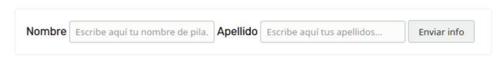
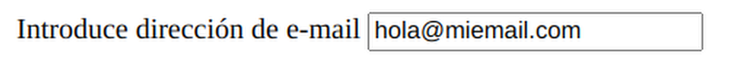

# Formularios
**action**: lugar donde vamos a ver los datos que introduzca el usuario en el formulario.

**for**: busca un input con el mismo id. (< label for = "interior" > < input id = "interior">)

## Type: "text"
**placeholder**: texto que se indica dentro del input.
**required**: campo requerido, obligatorio rellenar.

```html
<form action = "/enviar-respuesta"> <!-- Lugar donde vamos a ver los datos que introduzca el usuario en el formulario -->
    <input type = "text" placeholder = "URL de la foto de tu gato" required>
    <button type = "submit"> Enviar </button>
</form>
  ```



## Type: "radio"
**checked**: marca una opción por defecto.
**value**: indica al servidor ("/enviar-respuesta") qué opción es la que ha seleccionado el usuario.

```html
<form action = "/enviar-respuesta">
  <label for = "interior">
    <input id = "interior" type = "radio" checked value = "interior" name = "interior-exterior"> Interior
  </label>
  
  <br> <br>
  
  <label for = "exterior">
    <input id = "exterior" type = "radio" value = "exterior" name = "interior-exterior"> Exterior
  </label>
</form>
```


## Type: "checkbox"
Se pueden selecionar varias opciones.

```html
<form action = "/enviar-respuesta">
  <label for = "cariñoso">
    <input id = "carinoso" type = "checkbox" checked value = "cariñoso" name = "personalidad"> Cariñoso
  </label>
  
  <br><br>
  
  <label for = "perezoso">
    <input id = "perezoso" type = "checkbox" value = "personalidad"	name = "personalidad"> Perezoso
  </label>
  
  <br><br>
  
  <label for = "enérgico">
    <input id = "energico" type = "checkbox" value = "enérgico" name = "personalidad"> Enérgico
  </label>
</form>
```


## Type: "number"
No deja escribir letras

**min**: se indica un valor mínimo y el usuario tiene que rellenar el input con un número superior al indicado.

```html
<form action = "/enviar-respuesta">
  <label for = "edad">
    ¿Cuál es tu edad?
  </label>
	<input type = "number" name = "edad" id = "edad" min = "0"/>
</form>
```


## Type: "email"
Obliga a que haya un @.

```html
<form action = "/enviar-respuesta">
  <label for="email">
    Introduce dirección de e-mail
  </label>
  <input type="email" name="email" id="email"/>
</form>
```



## Type: "date"
Aparece en formato fecha, y un desplegable con un calendario.

```html
<form action = "/enviar-respuesta">
  <label for = "nacimiento">
    Fecha de nacimiento
  </label>
	<input type = "date" name = "nacimiento" id = "nacimiento"/>
</form>
```


## Type: "password"

```html
<form action = "/enviar-respuesta">
  <label for = "password">
    Contraseña 
  </label>
	<input type = "password" name = "password" id = "password" required/>
</form>
```


## < textarea > </ textarea>

```html
<form action = "/enviar-respuesta">
  <label for = "comentarios">
    Comentarios
  </label>
	<textarea name="comentarios" id = "comentarios"></textarea>
</form>
```
