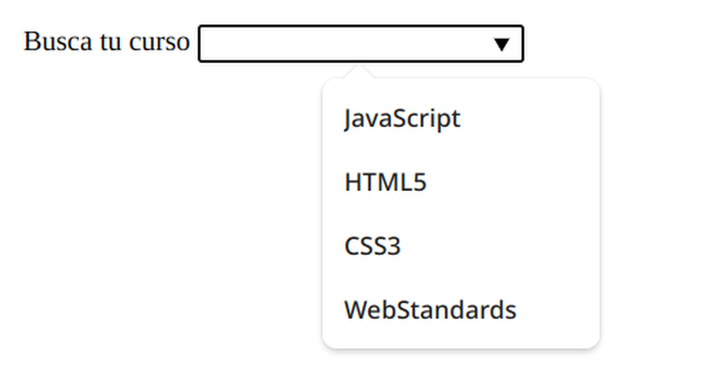
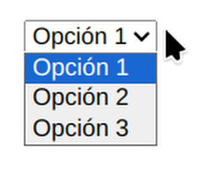
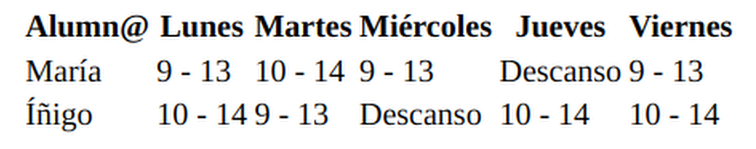

# Etiquetas

**< html > </ html >**:  TODO el contenido de la página

**< head > </ head >**: Es el lugar donde se ponen los elementos no visibles, como por ejemplo los metadatos (todos los elementos que están “detrás de escena”).

**< meta >**: Aporta información sobre el documento.

**< title > </ title >**: Define el título del documento que se muestra en un navegador la barra de título o la pestaña de una página.

**< abbr > </ abbr >**: Representa una abreviación o acrónimo

```html
<p>I do <abbr title="Hypertext Markup Language">HTML</abbr></p>
```

**< body > </ body >**: Contiene los elementos visibles. Toda la estructura de la página tiene que estar dentro de esta etiqueta.

**< header > </ header >**: cabecera o sección de presentación de un bloque.

**< main > </ main >**: Es el contenido principal de < body >. Debe ser único.

**< nav > </ nav >**: Un bloque de navegación, para un menú.

**< aside > </ aside >**: Un bloque de contenido de menor importancia o con contenido relacionado.

**< section > </ section >**: Se utiliza para agrupar contenidos por temática.

**< article > </ article >**: Un artículo, que aunque elimináramos el resto de contenido seguiría teniendo sentido por sí mismo.

**< h1 > </ h6 >**: Encabezados o títulos por nivel de índice.

**< p > </ p >**: Párrafos

**< ol >**: Order list.

**< ul >**: Unorder list.

**< li >**: Cada uno de los elementos de las listas (ol/ul).

**< strong > </ strong >**: Para resaltar texto importante (negrita).

**< em > </ em >**: Para resaltar texto importante (cursiva).

**< s > </ s >**: Para tachar el texto.

**< sup > </ sup >**: superíndice.

**< sub > </ sub >**: subíndice.

```html
<p>La fórmula química de agua: H<sub>2</sub>O</p>
```

**< small > </ small >**: Para hacer el texto un poquito más pequeño que el del resto de la web.

**< form > </ form >**: Para crear un [formulario.](./html-y-css/html-formularios.md)

**< input >**: Cada una de las “casillas” del formulario.

**< footer > </ footer >**: Pie de página, que se pone después del elemento </ main >, o sección final de un bloque.

**< blockquote > </ blockquote >**: Sirve para citas en bloque. Marca las citas a otros autores o documentos.

**< col > </ col >**: Permite especificar propiedades para una columna o un grupo de ellas.

**< colgroup > </ colgroup >**: Permite crear grupos de columnas.

**< link >**: Para importar “referencias externas” (CSS).

**< hr >**: Línea horizontal (para separar secciones).

**< div > </ div >**: Es un contenedor que sirve para agrupar otros elementos. Es para bloques de contenido.

**< span > </ span >**: Es un contenedor que está indicado para partes del texto o elementos en línea.

**< br >**: salto de línea.

## < a > </ a >

Enlace a otra página web o a un apartado de la propia página que estamos creando.

- Atributo **href=""**: aquí se indica "el lugar" que estamos enlazando.

```html
<!-- Ejemplos de enlaces <a>: -->

<!-- A otra página web -->
<a href="https://www.wikipedia.org">Wikipedia</a>

<!-- A un apartado de la propia página web -->
<a href="#top">Volver arriba</a>

<!-- Enlazar al contenido principal de mi página desde otra página -->
<a href="index.html#top">Volver al principio de la página principal</a>
```

- Atributo **title=""**: donde podemos añadir un texto complementario que el navegador mostrará en un pequeño tooltip cuando pongamos el cursor sobre el enlace. Nos interesará usarlo cuando tengamos un enlace tipo "descargar" y queramos asociarle un texto explicativo, como "Descargar archivo PDF".

- Atributo **target=""**: aquí podemos especificar dónde se abre el enlace. Por ejemplo, con el valor *_blank*, indicamos que se abra en una nueva pestaña, lo cual nos interesa cuando en nuestra página enlazamos a páginas externas y no queremos que la usuaria "pierda" nuestra página al hacer clic en esos enlaces.

## < datalist > </ datalist >

Aparece un desplegable donde puedes escribir para localizar más rápidamente la opción deseada.

```html
  <label for="cursos">Busca tu curso</label>
  <input type="text" list="cursos">
  <datalist id="cursos">
    <option value="JavaScript">JavaScript</option>
    <option value="HTML5">HTML5</option>
    <option value="CSS3">CSS3</option>
    <option value="WebStandards">WebStandards</option>
  </datalist>
  ```



## < select > </ select >

```html
<select>
	<option>Opción 1</option>
	<option>Opción 2</option>
	<option>Opción 3</option>
</select>
```



## < img >

.png: para logos. Se puede poner el cuadrado de fondo en transparente y así quedarnos solo con el logo.

.jpg: para imágenes.

.svg: para iconos o logotipos. Muy ligero, No perdemos calidad al aumentar o disminuir la ventana de navegación.

**width**: determina el ancho de la imagen.

**height**: determina el alto de la imagen.

- Atributo **src=""**: Aquí indicamos la ruta de nuestro archivo de imagen.

- Atributo **alt=""**: Es el texto que va a mostrar el navegador en caso de que la imagen no se pueda cargar. 

```html


```

## < video > </ video >
Se utilizan varias etiquetas < source > para asegurar que el navegador puede mostrar el video, ya que dentro de cada etiqueta ponemos diferentes extensiones de video (debería tenerlas todas desgargadas y guardadas en la carpeta...)

**width**: determina el ancho del vídeo.

**height**: determina el alto del vídeo.

**controls**: para que salgan los controles de reproducción del vídeo.

**autoplay**: se reproduce automáticamente.

**muted**: el audio está silenciado.

**loop**: se reproduce en bucle.


```html
<video controls width="300" height="300" controls autoplay muted loop>
<source src="./5764223-sd_426_240_24fps.mp4" #t="10,90"> 
<source src="./5764223-sd_426_240_24fps.m4v">
</video>

<audio controls autoplay loop>
	<source src=”gnr-welcome.mp3” type=”audio”>
</audio>
```

## < picture > </ picture >
Esta etiqueta carga las imágenes

```html
<picture>
<source srcset="./imgs/large.jpg">
<source srcset="./imgs/medium.jpg">

</picture>
```

## < table > </ table >
La tabla básica tiene una estructura bastante simple y tres etiquetas principales:
- Una etiqueta que indica que se va a escribir una tabla *< table >*.
- Una etiqueta para las filas *< tr >*.
- Una etiqueta para las celdas *< td >*.

```html
<table>
	<tr>
		<th>Alumn@</th>
		<th>Lunes</th>
		<th>Martes</th>
		<th>Miércoles</th>
		<th>Jueves</th>
		<th>Viernes</th>
	</tr>

	<tr>
		<td>María</td>
		<td>9 - 13</td>
		<td>10 - 14</td>
		<td>9 - 13</td>
		<td>Descanso</td>
		<td>9 - 13</td>
	</tr>

	<tr>
		<td>Íñigo</td>
		<td>10 - 14</td>
		<td>9 - 13</td>
		<td>Descanso</td>
		<td>10 - 14</td>
		<td>10 - 14</td>
	</tr>
</table>
```



**< caption > </ caption >**: Da el título descriptivo a las tablas.