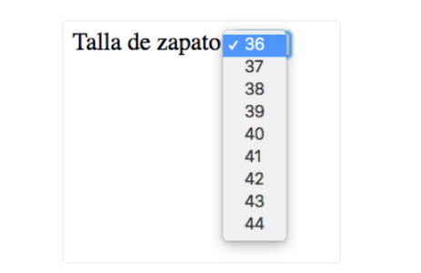

# Formularios

Todos los input van dentro de la etiqueta form, sino action no funciona.

Formspree.io --> te mandan un e-mail con los datos que ha rellenado la usuaria.

- **action**: dirección del servidor donde vamos a ver los datos que introduzca el usuario en el formulario.
- **method**: método utilizado para enviar la información (POST (contraseñas, DNI, datos bancarios...) o GET (resto de cosas)). El valor por defecto, si no se pone método, es GET.

- **for**: busca un input con el mismo id. (< label for = "interior" > < input id = "interior">)


En el botón de inspeccionar, pestaña Network- form - payload veo si se está enviando el formulario.

## Type="text"

**placeholder**: texto que se indica dentro del input.
**required**: campo requerido, obligatorio rellenar.

```html
<form action="/signup" method="POST">
  <label for="firstName">Nombre</label>
  <input
  placeholder="Escribe aquí tu nombre de pila"
  id="firstName"
  type="text"
  name="firstName"
  />
  <label for="lastName">Apellido</label>
  <input 
  placeholder="Escribe aquí tu apellido"
  id="lastName"
  type="text"
  name="lastName"
  />
 
  
  <input type="submit" value="Enviar"/>
  <input type="reset" value="Borrar"/>
<!-- Otra forma de crear el botón -->
  <button type="submit"> Enviar </button>
</form>
```


## Type="radio"
Sólo se puede elegir UNA opción.

**checked**: marca una opción por defecto.
**value**: indica al servidor ("/signup") qué opción es la que ha seleccionado el usuario.
**name**: todas las opciones tienen que tener el mismo nombre, para que se identifiquen con el mismo grupo.

```html
<h3>Método de pago:</h3>
<div>
  <label for="paymentmethod1">
    <input
      id="paymentmethod1"
      type="radio"
      value="debitcard"
      name="paymentmethods"
    />
    Tarjeta de débito
  </label>
</div>
<div>
  <label for="paymentmethod2">
    <input
      id="paymentmethod2"
      type="radio"
      value="creditcard"
      name="paymentmethods"
    />
    Tarjeta de crédito
  </label>
</div>
<div>
  <label for="paymentmethod3">
    <input
      id="paymentmethod3"
      type="radio"
      value="paypal"
      name="paymentmethods"
    />
    Paypal
  </label>
</div>
```


## Type="checkbox"

Se pueden selecionar varias opciones.
**name**: todas las opciones tienen que tener el mismo nombre, para que se identifiquen con el mismo grupo.

```html
<h3>Suplementos del vuelo:</h3>
<div>
  <label for="flightoption1">
    <input
      id="flightoption1"
      type="checkbox"
      value="chooseseat"
      name="flightoptions"
    />
    Selección de asiento
  </label>
</div>
<div>
  <label for="flightoption2">
    <input
      id="flightoption2"
      type="checkbox"
      value="assurance"
      name="flightoptions"
    />
    Seguro
  </label>
</div>
<div>
  <label for="flightoption3">
    <input
      id="flightoption3"
      type="checkbox"
      value="rentcar"
      name="flightoptions"
    />
    Coche de alquiler
  </label>
</div>
```


## Type="number"

No deja escribir letras.

**min**="0": se indica un valor mínimo y el usuario tiene que rellenar el input con un número superior al indicado.
**max**="10": se indica un valor mínimo y el usuario tiene que rellenar el input con un número inferior al indicado.
**step**="2": sirve para definir cómo será el incremento de los campos.

```html
<form action="/signup" method="POST">
  <label for="edad">
    ¿Cuál es tu edad?
  </label>
	<input type="number" name="edad" id="edad" min="0"/>
</form>
```


## Type="email"

Obliga a que haya un @.

```html
<form action="/signup" method="POST">
  <label for="emailAddress">
    Introduce dirección de e-mail
  </label>
  <input type="email" name="emailAddress" id="emailAddress"/>
</form>
```


## Type="tel"
Mostrará un teclado numérico si el usuario accede a la página con en el teléfono móvil.

```html
<form action="/signup" method="POST">
  <label for="telephone">Teléfono</label>
  <input type="tel" id="telephone" name="telephone" />
  <input type="submit" value="Enviar" />
</form>
```

## Type: "date"
Aparece en formato fecha, y un desplegable con un calendario.

```html
<form action="/signup" method="POST">
  <label for="nacimiento">
    Fecha de nacimiento
  </label>
	<input type="date" name="nacimiento" id="nacimiento"/>
</form>
```


## Type="password"
Sustituyen el texto que contienen por puntos negros (●) para aumentar la seguridad y que la contraseña no sea visible, y su contenido se borra si se recarga la página.

```html
<form action="/signup" method="POST">
  <label for="password">
    Contraseña 
  </label>
	<input type="password" name="password" id="password" required/>
</form>
```


## < textarea > </ textarea>

rows="8" define el número de filas (altura) que tendrá por defecto la etiqueta.
cols="80" define el número de columnas (anchura) que tendrá por defecto la etiqueta.

```html
<form action="/signup" method="POST">
  <label for="comentarios">
    Comentarios
  </label>
	<textarea name="comentarios" id="comentarios" rows="8" cols="80"></textarea>
</form>
```


## < select > </ select >
Crea selecciones que se excluyan entre sí y que permitan elegir entre varias opciones.

```html
<label for="size">Talla de zapato:</label>
<select id="size" name="size">
  <option value="36">36</option>
  <option value="37">37</option>
  <option value="38">38</option>
  <option value="39">39</option>
  <option value="40">40</option>
  <option value="41">41</option>
  <option value="42">42</option>
  <option value="43">43</option>
  <option value="44">44</option>
  <!-- ... continuación de la serie -->
</select>
```



## < fieldset > </ fieldset >
Se usa para crear secciones dentro de nuestro formulario.

```html
<fieldset>
  <label for="name">Nombre</label>
  <input type="text" id="name" name="name" />
  <label for="surnames">Apellidos</label>
  <input type="text" id="surnames" name="surnames" />
  <label for="phone">Teléfono</label>
  <input type="tel" id="phone" name="phone" />
  <label for="postalcode">Código postal</label>
  <input type="number" id="postalcode" name="postalcode" />
</fieldset>
```

## < legend > </ legend >
Se usa para asignar el nombre de una sección de nuestro formulario creada con `fieldset`. Siempre se mostrará en la parte superior izquierda, pero podemos modificar su posición con css.

```html
<fieldset>
  <legend>Datos personales:</legend>

  <label for="name">Nombre</label>
  <input type="text" id="name" name="name" />
  <label for="surnames">Apellidos</label>
  <input type="text" id="surnames" name="surnames" />
  <label for="phone">Teléfono</label>
  <input type="tel" id="phone" name="phone" />
  <label for="postalcode">Código postal</label>
  <input type="number" id="postalcode" name="postalcode" />
</fieldset>
```

## Restaurar el formulario a los valores por defecto:
Este botón borrará toda la información de los campos que haya dentro de la etiqueta `<form>` que lo contenga.

```html
<input type="reset" value="Restaurar valores por defecto" />
```

## Expresiones regulares (aka regex o regexp)

Para una matrícula, el re gexp que habría que utilizar es: `pattern="^[0-9]{4}[a-zA-Z]{3}$"`

- ^: el acento circunflejo ^ indica el inicio de la expresión regular.

- [0-9]: la regex espera caracteres del 0 al 9, es decir, números.

- {4}: la regex espera 4 caracteres de los anteriores, es decir, 4 números.

- [a-zA-Z]: a continuación de los 4 números, porque el orden es importante, la regex espera caracteres de la a a la z (en minúsculas) y/o de la A a la Z en mayúsculas.

- {3}: cuántas letras de las anteriores espera, pues 3.

- $: aquí debe acabar la regex, es decir si hubiese más caracteres después de las 3 letras, entonces no sería una matrícula.

Para un nombre: `pattern="[A-Za-z]+"`
Para e-mail: `pattern="[a-z0-9._%+-]+@[a-z0-9.-]+\.[a-z]{2,}"`
Para DNI:`pattern="^\d{8}[A-Za-z]$"`
Para teléfono: `pattern="^(\+?\d{1,3}[- ]?)?$?\d{1,4}?$?[- ]?\d{1,4}[- ]?\d{1,9}$"`