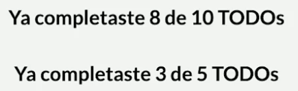

**Apuntes de React de un chico de Platzi**

https://github.com/aleroses/Platzi/blob/master/DW/3-avanzado/1.react.js/Platzi/reactjs.md

**Crear un comentario**

```javascript
{/* <CreateTodoButton/> */}
```

**Ctrl+espacio**
Al hacer doble click en un componente (seleccionarlo), si se pulsa ctrl+espacio, sale un aviso de que hay un archivo que se llama igual, y si clickas en el aviso, importa el componente.

## ¿Qué es un componente de React.js?

Si en un proyecto de React nos encontramos una función donde su nombre empieza con una letra mayúscula, 99% es un componente

```javascript
function App() {} // componente de React.js
```

## Ejecutar código en React

Abrir la terminal y escribir: npm start - enter - click en el http

## Diferenciar html de jsx

Lo que está dentro del **componente de React.js** es jsx. Lo diferenciamos de html porque, por ejemplo, en jsx ponemos className, en lugar de solo class.

Más adelante, esto se convertiá en html.
```javascript
function App() {
  return (
    <div className="App">

      <TodoItem/>
      <TodoItem/>
      <TodoItem/>

      <header className="App-header">
        
        <p>
          Edita el archivo <code>src/App.js</code> y guarda para recargar.
        </p>
        <a
          className="App-link"
          href="https://platzi.com/reactjs"
          target="_blank"
          rel="noopener noreferrer"
        >
          Aprendamos React
        </a>
      </header>
    </div>
  );
}
```

## ¿Qué es un elemento de React.js?

Un elemento es una "etiqueta de html". En el ejemplo sería <span>

```javascript
function TodoItem() {
  return(
    <li>
      <span>V</span>
      <p>Llorar con la Llorona</p>
      <span>X</span>
    </li>
  );
}
```

## Recibir propiedades
Permiten cambiar valores para que sean dinámicos.

```javascript
function TodoCount(props) { // componente
  return (
    // propiedad
    <h1>  
      Completaste
      {props.completed} de
      {props.total} TODOs
    </h1>
  );
}
```

Esto se transforma, con la máquina de render de React, en JavaScript de verdad así:

```javascript
function TodoCount(props) {
  return (
    React.createElement(
      'h1',
      null,
      `Completaste
      ${props.completed} de
      ${props.total} TODOs`
    )
  );
}
```

## Enviar propiedades

```javascript
<TodoCount
  completed={8}
  total={10}
/>

<TodoCount
  completed={3}
  total={5}
/>
```



## Comunicación entre componentes por medio de props

## Local Storage
Guarda el historial.

En la consola:
- localStorage.setItem('key', 'value'): añade un elemento con una clave y un valor al almacenamiento local.
- localStorage.getItem('key'): recupera el valor de la clave especificada en el almacenamiento local.
- localStorage.removeItem('key'): elimina el elemento del almacenamiento local según la clave especificada.
- localStorage.clear(): elimina todo el almacenamiento local.

- localStorage solo puede guardar strings, así que cada vez que queramos guardar algo en localStorage hay que utilizar la siguiente función:
  - JSON.stringify(): convierte JavaScript en strings.
- Para poder leer algo que hemos guardado en localStorage hay que utilizar la siguiente función:
  - JSON.parse(): convierte un string en array.

Ejemplo en consola:

```javascript
const defaultTodos = [
  {text: 'Cortar cebolla', completed: true},
  {text: 'Curso React.js', completed: false},
  {text: 'Saltar a la comba', completed: false},
  {text: 'Piscina', completed: true},
];

JSON.stringify(defaultTodos) // '[{"text":"Cortar cebolla","completed":true},{"text":"Curso React.js","completed":false},{"text":"Saltar a la comba","completed":false},{"text":"Piscina","completed":true}]'


const stringifyedTodos = JSON.stringify(defaultTodos)

stringifyedTodos // '[{"text":"Cortar cebolla","completed":true},{"text":"Curso React.js","completed":false},{"text":"Saltar a la comba","completed":false},{"text":"Piscina","completed":true}]'


JSON.parse(stringifyedTodos)

// (4) [{…}, {…}, {…}, {…}]
// 0
// : 
// {text: 'Cortar cebolla', completed: true}
// 1
// : 
// {text: 'Curso React.js', completed: false}
// 2
// : 
// {text: 'Saltar a la comba', completed: false}
// 3
// : 
// {text: 'Piscina', completed: true}
// length
// : 
// 4
// [[Prototype]]
// : 
// Array(0)

```

## Custom Hooks
Separar la lógica de un componente cuando es demasiado compleja o "enguarrina" el código y no deja que se lea facilmente.

## React Context

**Prop Drilling**: es un paso del desarrollo que ocurre cuando necesitamos obtener datos que están en varias capas en el árbol de componentes React.

Este se ve siempre cuando pasamos props entre hijos, luego ese a otros hijos y así sucesivamente... la solución es usar context:

**Context**: es un elemento que podemos crear en React para establecer una comunicación directa entre un componente en un nivel muy alto y uno en un nivel mucho más bajo.

Por ende, context permite acceder a los valores de forma directa.